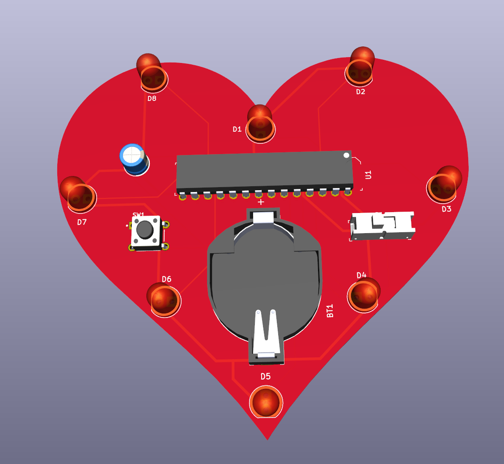

# Heart PCB
A simple PCB designed for my girlfriend. 
## Utilizes:
1. Circuit/Hardware Design
2. Low-Level Embedded C Programming
3. Hardware Interrupts
4. PCB Design Software (KiCad)

## Schematic
